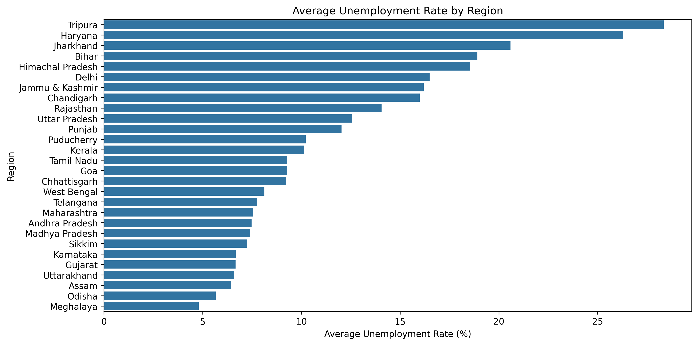
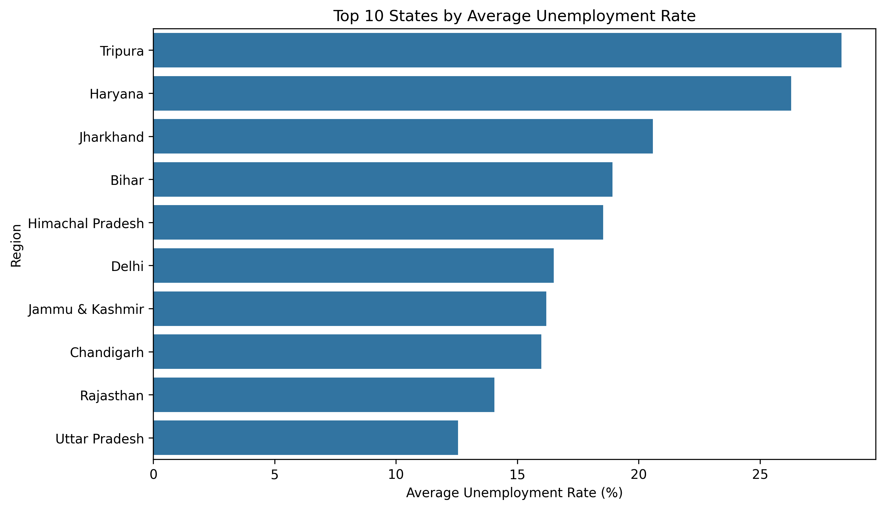
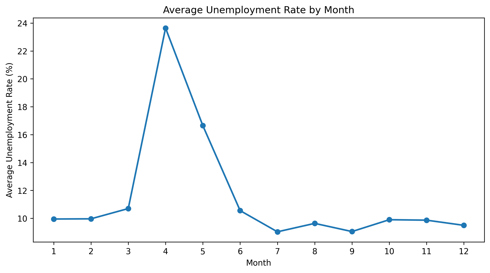
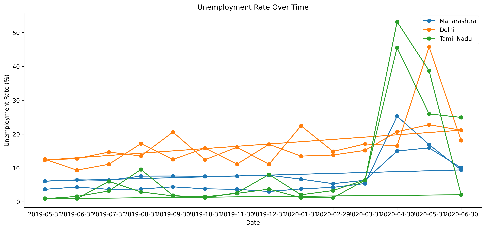
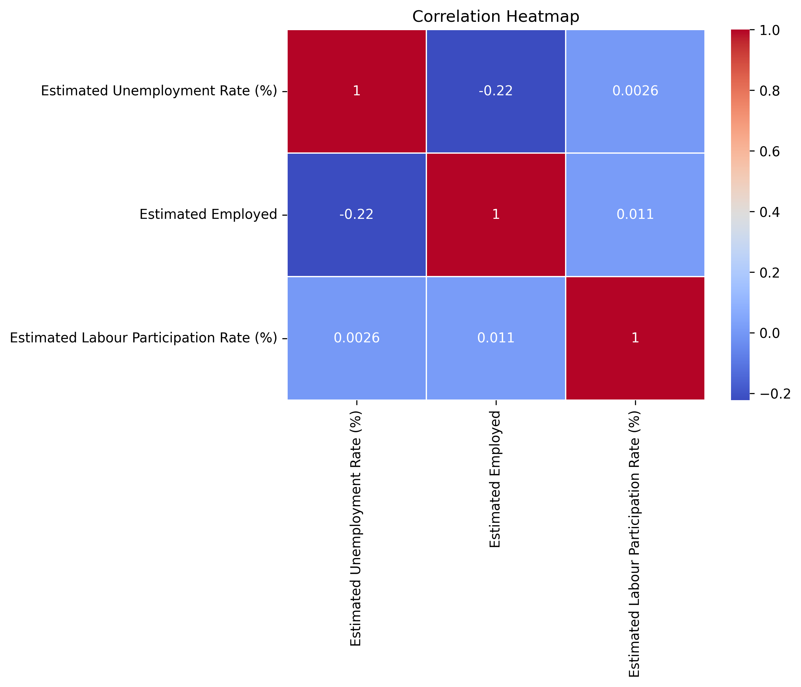
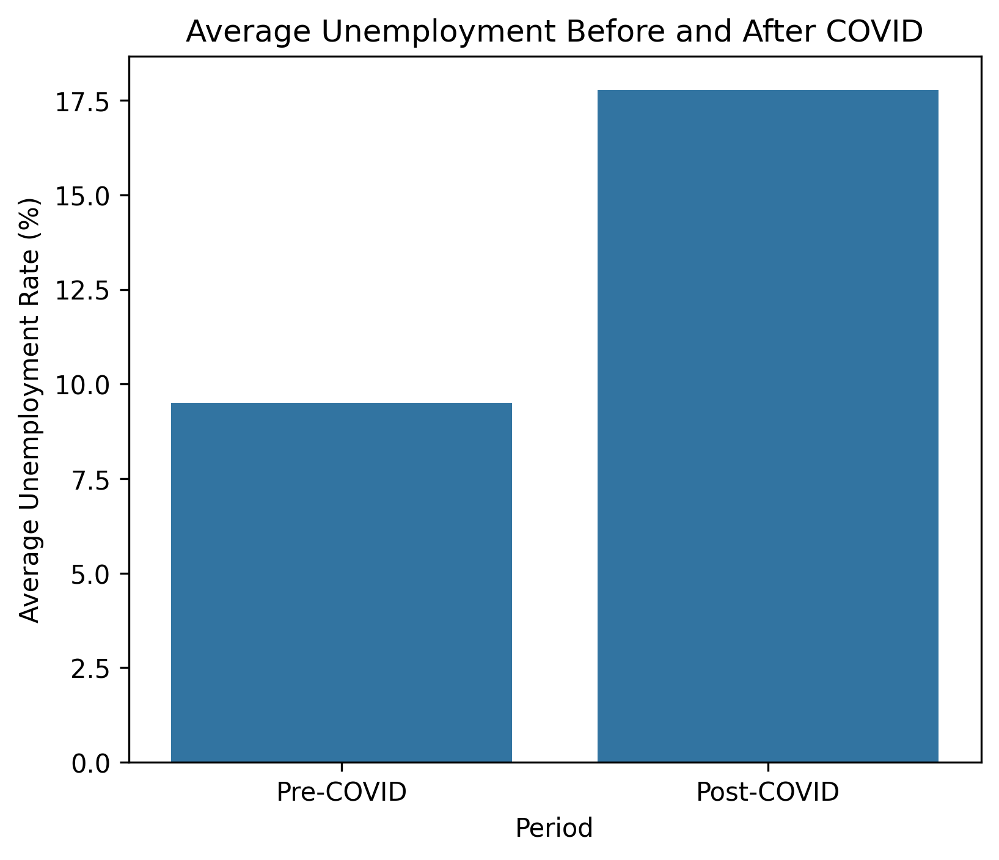
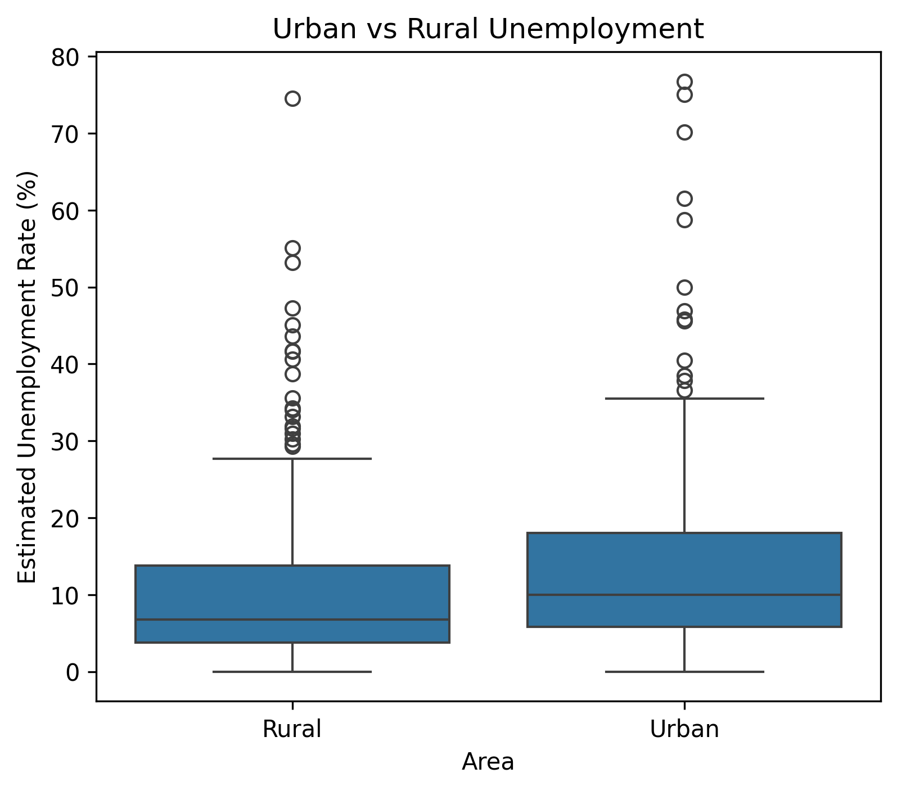

# 📉 India Unemployment Analysis: The COVID-19 Shock

**An exploratory data analysis of India's labour market before and during the COVID-19 pandemic (May 2019 – June 2020), uncovering how a nationwide lockdown reshaped employment across states, sectors, and seasons.**

---

## 📖 The Story in One Paragraph

India entered 2020 with an unemployment rate hovering around **9–10%**, a figure already marked by wide regional inequality. Then, in a matter of weeks, that number nearly **doubled to 17.5%** as the country went into lockdown. This project traces that story through the data — from calm, pre-pandemic baselines, to an April 2020 shock that pushed states like **Tamil Nadu from ~4% to a staggering 47% unemployment**, to the beginning of a fragile recovery by year's end. Along the way, it asks a harder question: was this crisis felt equally everywhere, or did it expose fault lines that already existed between states, and between rural and urban India?

---

## 🎯 Objective

To clean, explore, and visualize India's unemployment data in order to answer three questions:

1. **Where** was unemployment structurally worse, independent of COVID-19?
2. **When** did the pandemic hit hardest, and how sharp was the shock?
3. **Who** was more exposed — rural or urban workers — and did labour participation actually protect people from unemployment?

---

## 🗂️ Dataset

| | |
|---|---|
| **Source file** | `data/Unemployment_in_India.csv` (raw) → `data/Unemployment_Cleaned.csv` (processed) |
| **Observations** | 740 monthly records |
| **Regions covered** | 28 Indian states/union territories |
| **Time span** | May 2019 – June 2020 |
| **Granularity** | Monthly, split by Rural and Urban areas |

**Key columns:**

| Column | Description |
|---|---|
| `Region` | Indian state or union territory |
| `Date` | Observation month (end-of-month) |
| `Estimated Unemployment Rate (%)` | Share of the labour force without work |
| `Estimated Employed` | Number of people employed |
| `Estimated Labour Participation Rate (%)` | Share of working-age population actively working or seeking work |
| `Area` | Rural or Urban |
| `Year`, `Month` | Engineered from `Date` for trend analysis |

---

## 🧹 Data Cleaning Pipeline

*Notebook: `notebooks/Chaymae_Hanini_Task2_Cleaning_Data.ipynb`*

The raw dataset arrived with the usual real-world mess: inconsistent spacing, stray blank rows, and dates stored as text. The cleaning process:

1. **Diagnosed the data** — inspected shape, dtypes, missing values, and duplicate rows.
2. **Dropped fully empty rows** that added no information.
3. **Stripped whitespace** from column names (e.g. `" Date"` → `"Date"`) to prevent silent key errors downstream.
4. **Parsed dates properly**, converting the `Date` column from string to `datetime` (day-first format).
5. **Engineered time features** — extracted `Year` and `Month` to enable seasonal and pre/post-pandemic comparisons.
6. **Exported a clean, analysis-ready file**: `data/Unemployment_Cleaned.csv`.

Result: a fully typed, duplicate-free, 740-row dataset with zero missing values.

---

## 📊 Exploratory Analysis & Key Findings

*Notebook: `notebooks/Chaymae_Hanini_Task2_EDA.ipynb`*

Each finding below is backed by a chart in the [`report/`](./report) folder.

### 1. Regional inequality was already severe — before COVID even hit



**What the chart shows:** the average unemployment rate for every state, sorted highest to lowest.

**In simple terms:** if unemployment were the same everywhere, this bar chart would look flat. It doesn't. **Tripura (~26.5%) and Haryana (~25.5%)** tower over the rest, while **Karnataka, Gujarat, Uttarakhand, and Odisha** sit near ~2.5%. That's a 10x gap between the best and worst states — this inequality exists independent of COVID and points to deeper structural differences in each state's job market.



**What the chart shows:** a zoomed-in view of just the 10 worst-performing states.

**In simple terms:** this confirms the same story with a tighter lens — **Tripura and Haryana lead**, followed closely by **Jharkhand and Bihar**. When the "worst 10" list stays this consistent across different views of the data, it's a reliable signal, not noise.

---

### 2. April 2020 is the story's turning point



**What the chart shows:** the national average unemployment rate, month by month.

**In simple terms:** this line is basically flat around 9–10% for months — then it shoots straight up to **~24% in April 2020**. That's the exact month India's COVID-19 lockdown began. After the spike, the line slowly drifts back down toward 9–10% by the end of the year, forming a shape like the letter **"V"** — a sharp fall, followed by a gradual recovery.

---

### 3. The shock hit some states far harder than others



**What the chart shows:** three individual states — Maharashtra, Delhi, and Tamil Nadu — tracked over time instead of averaged together.

**In simple terms:** averages can hide extremes, so this chart checks individual states. The result is dramatic: **Tamil Nadu rockets from ~4% to ~47%** — meaning almost half its workforce was suddenly without work. Delhi and Maharashtra also spike, but less severely (~20% and ~16%). Before 2020, all three lines were calm and low. This tells us the lockdown's impact wasn't equal — some regional economies simply had further to fall.

---

### 4. Employment metrics don't move together the way you'd expect



**What the chart shows:** a heatmap measuring how strongly three variables move together — unemployment rate, number employed, and labour participation rate. Values close to **+1** mean "move together strongly," close to **0** means "barely related," and close to **-1** means "move in opposite directions."

**In simple terms:** unemployment rate and number employed have a **mild negative correlation (-0.22)** — when unemployment rises, the employed count tends to drop slightly, as you'd expect, but the relationship is weak, not a strong 1-to-1 swing. More strikingly, **labour participation rate is essentially uncorrelated with both** (values near 0). In other words, how many people are actively in the workforce tells you almost nothing about whether they'll end up employed or not — participation and outcomes are largely disconnected.

---

### 5. The pandemic nearly doubled unemployment nationally



**What the chart shows:** a simple two-bar comparison — average unemployment before March 2020 vs. after.

**In simple terms:** this is the clearest single summary of the whole crisis. **Pre-COVID: 9.5%. Post-COVID: 17.5%.** Almost double. One chart, one line of insight: the lockdown nearly doubled joblessness across the country.

---

### 6. Rural and urban workers were both hit — but differently



**What the chart shows:** a box plot comparing the spread of unemployment rates in Rural vs. Urban areas. The box shows where most values fall (the middle 50%), the line in the middle is the median, and the dots above are outliers (unusual extreme values).

**In simple terms:** **Urban areas actually have a slightly higher typical unemployment rate** (median ~10%) than Rural areas (median ~7%), and a wider "normal" range. Both groups have extreme outlier months — a few regions spiked past 70% — but these outliers appear in both Rural and Urban data, showing the COVID shock wasn't confined to one setting. The takeaway: urban unemployment was consistently a bit higher day-to-day, while both rural and urban areas were equally capable of experiencing extreme, crisis-level spikes.

---

## 🧾 Bottom Line

- Unemployment in India is not uniform — it's a patchwork shaped by state-level economic structure.
- COVID-19 didn't create inequality, but it dramatically **amplified** it, with the April 2020 lockdown standing out as a clear before/after boundary.
- Labour participation rate is **not** a reliable proxy for employment health — the two barely correlate.
- Urban areas ran a slightly higher baseline unemployment rate than rural areas, but both experienced extreme crisis-level spikes during the lockdown.

---

## 📁 Project Structure

```
Task_02_Unemployment_Analysis/
├── data/
│   ├── Unemployment_in_India.csv       # Raw dataset
│   └── Unemployment_Cleaned.csv        # Cleaned, analysis-ready dataset
├── notebooks/
│   ├── Chaymae_Hanini_Task2_Cleaning_Data.ipynb   # Cleaning & feature engineering
│   └── Chaymae_Hanini_Task2_EDA.ipynb             # Exploratory analysis & visualizations
├── report/
│   ├── 01_region_average_unemployment.png
│   ├── 02_monthly_unemployment_trend.png
│   ├── 03_unemployment_time_series.png
│   ├── 04_top10_states_unemployment.png
│   ├── 05_correlation_heatmap.png
│   ├── 06_pre_vs_post_covid.png
│   └── 07_urban_vs_rural.png
├── requirements.txt
└── README.md
```

---

## 🛠️ Tech Stack

- **Python 3**
- **pandas** & **numpy** — data cleaning and manipulation
- **matplotlib** & **seaborn** — visualization
- **Jupyter Notebook** — analysis environment

---

## ▶️ How to Reproduce

```bash
# 1. Clone the repository
git clone <repo-url>
cd Task_02_Unemployment_Analysis

# 2. Install dependencies
pip install -r requirements.txt

# 3. Run the notebooks in order
jupyter notebook notebooks/Chaymae_Hanini_Task2_Cleaning_Data.ipynb
jupyter notebook notebooks/Chaymae_Hanini_Task2_EDA.ipynb
```

Running the cleaning notebook regenerates `data/Unemployment_Cleaned.csv`; running the EDA notebook regenerates all charts in `report/`.

---

## ✍️ Author

**Chaymae Hanini**
=======
# 📉 India Unemployment Analysis: The COVID-19 Shock

**An exploratory data analysis of India's labour market before and during the COVID-19 pandemic (May 2019 – June 2020), uncovering how a nationwide lockdown reshaped employment across states, sectors, and seasons.**

---

## 📖 The Story in One Paragraph

India entered 2020 with an unemployment rate hovering around **9–10%**, a figure already marked by wide regional inequality. Then, in a matter of weeks, that number nearly **doubled to 17.5%** as the country went into lockdown. This project traces that story through the data — from calm, pre-pandemic baselines, to an April 2020 shock that pushed states like **Tamil Nadu from ~4% to a staggering 47% unemployment**, to the beginning of a fragile recovery by year's end. Along the way, it asks a harder question: was this crisis felt equally everywhere, or did it expose fault lines that already existed between states, and between rural and urban India?

---

## 🎯 Objective

To clean, explore, and visualize India's unemployment data in order to answer three questions:

1. **Where** was unemployment structurally worse, independent of COVID-19?
2. **When** did the pandemic hit hardest, and how sharp was the shock?
3. **Who** was more exposed — rural or urban workers — and did labour participation actually protect people from unemployment?

---

## 🗂️ Dataset

| | |
|---|---|
| **Source file** | `data/Unemployment_in_India.csv` (raw) → `data/Unemployment_Cleaned.csv` (processed) |
| **Observations** | 740 monthly records |
| **Regions covered** | 28 Indian states/union territories |
| **Time span** | May 2019 – June 2020 |
| **Granularity** | Monthly, split by Rural and Urban areas |

**Key columns:**

| Column | Description |
|---|---|
| `Region` | Indian state or union territory |
| `Date` | Observation month (end-of-month) |
| `Estimated Unemployment Rate (%)` | Share of the labour force without work |
| `Estimated Employed` | Number of people employed |
| `Estimated Labour Participation Rate (%)` | Share of working-age population actively working or seeking work |
| `Area` | Rural or Urban |
| `Year`, `Month` | Engineered from `Date` for trend analysis |

---

## 🧹 Data Cleaning Pipeline

*Notebook: `notebooks/Chaymae_Hanini_Task2_Cleaning_Data.ipynb`*

The raw dataset arrived with the usual real-world mess: inconsistent spacing, stray blank rows, and dates stored as text. The cleaning process:

1. **Diagnosed the data** — inspected shape, dtypes, missing values, and duplicate rows.
2. **Dropped fully empty rows** that added no information.
3. **Stripped whitespace** from column names (e.g. `" Date"` → `"Date"`) to prevent silent key errors downstream.
4. **Parsed dates properly**, converting the `Date` column from string to `datetime` (day-first format).
5. **Engineered time features** — extracted `Year` and `Month` to enable seasonal and pre/post-pandemic comparisons.
6. **Exported a clean, analysis-ready file**: `data/Unemployment_Cleaned.csv`.

Result: a fully typed, duplicate-free, 740-row dataset with zero missing values.

---

## 📊 Exploratory Analysis & Key Findings

*Notebook: `notebooks/Chaymae_Hanini_Task2_EDA.ipynb`*

Each finding below is backed by a chart in the [`report/`](./report) folder.

### 1. Regional inequality was already severe — before COVID even hit


**What the chart shows:** the average unemployment rate for every state, sorted highest to lowest.

**In simple terms:** if unemployment were the same everywhere, this bar chart would look flat. It doesn't. **Tripura (~26.5%) and Haryana (~25.5%)** tower over the rest, while **Karnataka, Gujarat, Uttarakhand, and Odisha** sit near ~2.5%. That's a 10x gap between the best and worst states — this inequality exists independent of COVID and points to deeper structural differences in each state's job market.


**What the chart shows:** a zoomed-in view of just the 10 worst-performing states.

**In simple terms:** this confirms the same story with a tighter lens — **Tripura and Haryana lead**, followed closely by **Jharkhand and Bihar**. When the "worst 10" list stays this consistent across different views of the data, it's a reliable signal, not noise.

---

### 2. April 2020 is the story's turning point


**What the chart shows:** the national average unemployment rate, month by month.

**In simple terms:** this line is basically flat around 9–10% for months — then it shoots straight up to **~24% in April 2020**. That's the exact month India's COVID-19 lockdown began. After the spike, the line slowly drifts back down toward 9–10% by the end of the year, forming a shape like the letter **"V"** — a sharp fall, followed by a gradual recovery.

---

### 3. The shock hit some states far harder than others


**What the chart shows:** three individual states — Maharashtra, Delhi, and Tamil Nadu — tracked over time instead of averaged together.

**In simple terms:** averages can hide extremes, so this chart checks individual states. The result is dramatic: **Tamil Nadu rockets from ~4% to ~47%** — meaning almost half its workforce was suddenly without work. Delhi and Maharashtra also spike, but less severely (~20% and ~16%). Before 2020, all three lines were calm and low. This tells us the lockdown's impact wasn't equal — some regional economies simply had further to fall.

---

### 4. Employment metrics don't move together the way you'd expect


**What the chart shows:** a heatmap measuring how strongly three variables move together — unemployment rate, number employed, and labour participation rate. Values close to **+1** mean "move together strongly," close to **0** means "barely related," and close to **-1** means "move in opposite directions."

**In simple terms:** unemployment rate and number employed have a **mild negative correlation (-0.22)** — when unemployment rises, the employed count tends to drop slightly, as you'd expect, but the relationship is weak, not a strong 1-to-1 swing. More strikingly, **labour participation rate is essentially uncorrelated with both** (values near 0). In other words, how many people are actively in the workforce tells you almost nothing about whether they'll end up employed or not — participation and outcomes are largely disconnected.

---

### 5. The pandemic nearly doubled unemployment nationally


**What the chart shows:** a simple two-bar comparison — average unemployment before March 2020 vs. after.

**In simple terms:** this is the clearest single summary of the whole crisis. **Pre-COVID: 9.5%. Post-COVID: 17.5%.** Almost double. One chart, one line of insight: the lockdown nearly doubled joblessness across the country.

---

### 6. Rural and urban workers were both hit — but differently


**What the chart shows:** a box plot comparing the spread of unemployment rates in Rural vs. Urban areas. The box shows where most values fall (the middle 50%), the line in the middle is the median, and the dots above are outliers (unusual extreme values).

**In simple terms:** **Urban areas actually have a slightly higher typical unemployment rate** (median ~10%) than Rural areas (median ~7%), and a wider "normal" range. Both groups have extreme outlier months — a few regions spiked past 70% — but these outliers appear in both Rural and Urban data, showing the COVID shock wasn't confined to one setting. The takeaway: urban unemployment was consistently a bit higher day-to-day, while both rural and urban areas were equally capable of experiencing extreme, crisis-level spikes.

---

## 🧾 Bottom Line

- Unemployment in India is not uniform — it's a patchwork shaped by state-level economic structure.
- COVID-19 didn't create inequality, but it dramatically **amplified** it, with the April 2020 lockdown standing out as a clear before/after boundary.
- Labour participation rate is **not** a reliable proxy for employment health — the two barely correlate.
- Urban areas ran a slightly higher baseline unemployment rate than rural areas, but both experienced extreme crisis-level spikes during the lockdown.

---

## 📁 Project Structure

```
Task_02_Unemployment_Analysis/
├── data/
│   ├── Unemployment_in_India.csv       # Raw dataset
│   └── Unemployment_Cleaned.csv        # Cleaned, analysis-ready dataset
├── notebooks/
│   ├── Chaymae_Hanini_Task2_Cleaning_Data.ipynb   # Cleaning & feature engineering
│   └── Chaymae_Hanini_Task2_EDA.ipynb             # Exploratory analysis & visualizations
├── report/
│   ├── 01_region_average_unemployment.png
│   ├── 02_monthly_unemployment_trend.png
│   ├── 03_unemployment_time_series.png
│   ├── 04_top10_states_unemployment.png
│   ├── 05_correlation_heatmap.png
│   ├── 06_pre_vs_post_covid.png
│   └── 07_urban_vs_rural.png
├── requirements.txt
└── README.md
```

---

## 🛠️ Tech Stack

- **Python 3**
- **pandas** & **numpy** — data cleaning and manipulation
- **matplotlib** & **seaborn** — visualization
- **Jupyter Notebook** — analysis environment

---

## ▶️ How to Reproduce

```bash
# 1. Clone the repository
git clone <repo-url>
cd Task_02_Unemployment_Analysis

# 2. Install dependencies
pip install -r requirements.txt

# 3. Run the notebooks in order
jupyter notebook notebooks/Chaymae_Hanini_Task2_Cleaning_Data.ipynb
jupyter notebook notebooks/Chaymae_Hanini_Task2_EDA.ipynb
```

Running the cleaning notebook regenerates `data/Unemployment_Cleaned.csv`; running the EDA notebook regenerates all charts in `report/`.

---

## ✍️ Author

**Chaymae Hanini**
>>>>>>> db56c6a (Update OIBSIP Internship)
