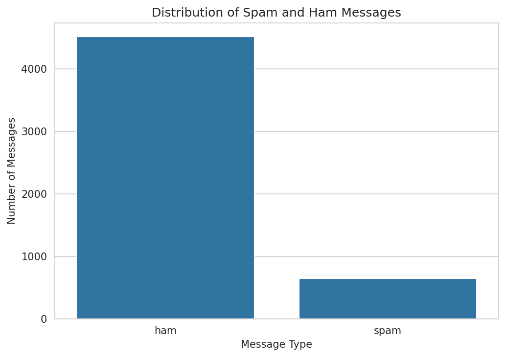
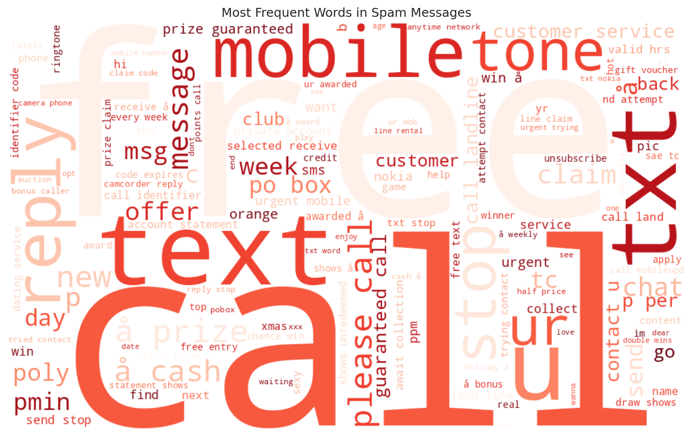
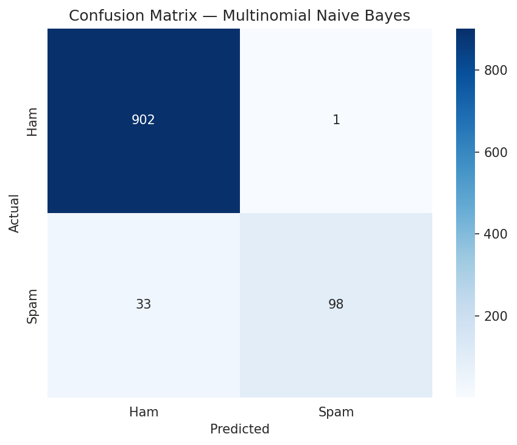

# 📧 Email Spam Detection with Machine Learning

A Natural Language Processing (NLP) project that classifies SMS/email messages as **spam** or **ham** (legitimate) using classic machine learning techniques — TF-IDF feature extraction combined with Multinomial Naive Bayes and Logistic Regression.



## 📌 Overview

Unwanted spam messages are a persistent nuisance and, in some cases, a security risk (phishing, scams). This project builds and compares two supervised classifiers that automatically flag spam messages from their raw text content, using only traditional, lightweight ML methods — no deep learning required.

**Pipeline:**

```
Raw messages → Cleaning & dedup → Text preprocessing → TF-IDF vectorization
            → Train/test split (stratified) → Model training → Evaluation → Model persistence
```

## 🗂️ Project Structure

```
Task_04_Email_Spam_Detection/
├── data/
│   ├── spam.csv                 # Original raw dataset (SMS Spam Collection)
│   └── spam_Cleaned.csv         # De-duplicated, null-free version used downstream
├── images/
│   ├── class_distribution.png            # Ham vs. Spam class balance
│   ├── wordcloud_spam.png                # Most frequent words in spam messages
│   ├── wordcloud_ham.png                 # Most frequent words in ham messages
│   ├── confusion_matrix_naive_bayes.png  # Confusion matrix — Naive Bayes
│   ├── confusion_matrix_logistic_regression.png  # Confusion matrix — Logistic Regression
│   └── model_comparison.png              # Accuracy / Precision / Recall / F1 comparison
├── models/
│   └── tfidf_naivebayes.pkl     # Pickled dict: {vectorizer, model, model_name, label_map}
├── notebooks/
│   └── Chaymae_Hanini_Task4.ipynb   # Full, executed, end-to-end analysis
├── requirements.txt
└── README.md
```

## 📊 Dataset

The [SMS Spam Collection](https://archive.ics.uci.edu/dataset/228/sms+spam+collection) dataset contains **5,572** raw text messages labeled `ham` or `spam`. After removing **403 exact duplicate rows**, the working dataset contains **5,169** unique messages:

| Label | Count | Share |
|-------|------:|------:|
| Ham   | 4,516 | ~87% |
| Spam  |   653 | ~13% |

The dataset is **imbalanced**, which is why accuracy alone is not used as the sole evaluation criterion — precision, recall, F1-score, and the confusion matrix are also reported.

## 🧹 Text Preprocessing

Each message is normalized before vectorization:

1. Lowercasing
2. Punctuation removal
3. Digit removal
4. English stopword removal (NLTK)
5. Re-joining into a single cleaned string

## 🔤 Feature Extraction — TF-IDF

Cleaned text is converted into numerical features using `TfidfVectorizer` (`max_features=5000`, `ngram_range=(1, 2)`). The vectorizer is **fit only on the training split** and then used to transform the test split, avoiding data leakage.

## 🤖 Models

Two classifiers are trained and compared:

| Model | Accuracy | Precision (Spam) | Recall (Spam) | F1-score (Spam) |
|---|---:|---:|---:|---:|
| **Multinomial Naive Bayes** | 0.967 | 0.990 | 0.748 | **0.852** |
| Logistic Regression | 0.955 | 0.988 | 0.649 | 0.783 |

*(Test split: 20% of the data, stratified by label, `random_state=42`. Exact numbers may vary slightly by environment/library version.)*

**Multinomial Naive Bayes** achieves the best F1-score and is selected as the final model, saved to `models/tfidf_naivebayes.pkl`.

### Why recall matters here
A **false negative** (spam predicted as ham) means an unwanted or potentially harmful message reaches the user's inbox — the costlier failure mode in spam filtering. Recall on the spam class is therefore tracked explicitly, alongside precision and F1, rather than optimizing for raw accuracy on an imbalanced dataset.

## 🖼️ Visualizations

| | |
|---|---|
|  |  |
| Most frequent words in spam messages | Confusion matrix — Naive Bayes |

All figures are generated by the notebook and saved automatically to `images/`.

## 🚀 Getting Started

### 1. Install dependencies
```bash
pip install -r requirements.txt
```

### 2. Run the notebook
```bash
jupyter notebook notebooks/Chaymae_Hanini_Task4.ipynb
```
Running all cells will regenerate every figure in `images/` and re-save the trained model to `models/tfidf_naivebayes.pkl`.

### 3. Use the saved model for inference
```python
import pickle, re
from nltk.corpus import stopwords

stop_words = set(stopwords.words("english"))

def preprocess_text(text):
    text = text.lower()
    text = re.sub(r"[^\w\s]", "", text)
    text = re.sub(r"\d+", "", text)
    words = [w for w in text.split() if w not in stop_words]
    return " ".join(words)

with open("models/tfidf_naivebayes.pkl", "rb") as f:
    artifact = pickle.load(f)

vectorizer = artifact["vectorizer"]
model = artifact["model"]

message = "Congratulations! You've won a free ticket, call now to claim your prize!"
vect = vectorizer.transform([preprocess_text(message)])
prediction = model.predict(vect)[0]
print("SPAM" if prediction == 1 else "HAM")
```

## 🔧 Fixes Applied in This Version

This version of the project addresses several gaps found in the original submission:

- **Empty deliverables filled in**: `README.md` and `requirements.txt` were empty; `images/*.png` and `models/tfidf_naivebayes.pkl` existed as 0-byte placeholders with no code in the notebook that generated them.
- **Reproducible visualizations**: every plot the notebook produces (`class_distribution`, `wordcloud_spam`, `wordcloud_ham`, both confusion matrices, `model_comparison`) is now saved to `images/` with `plt.savefig(...)` instead of only being shown inline.
- **Word cloud code added**: the notebook previously shipped a `wordcloud_spam.png` file with no corresponding generation code; this has been implemented (plus a ham word cloud for comparison).
- **Model persistence added**: the notebook previously had no code that produced `models/tfidf_naivebayes.pkl`. It now trains both models, selects the best one by F1-score, and pickles the **vectorizer and model together** (both are required at inference time) with `os.makedirs(..., exist_ok=True)` guards so the folders always exist.
- **Inference example added**: a runnable cell demonstrates loading the saved artifact and classifying new, unseen messages.
- **Reproducibility**: a single `RANDOM_STATE = 42` is used consistently across the train/test split, word cloud generation, and Logistic Regression (which previously had no fixed seed).
- **Stray files cleaned up**: removed `.ipynb_checkpoints` directories that had been accidentally included in the deliverable.

## 📈 Possible Future Improvements

- Add more classifiers (Linear SVM, Random Forest, Gradient Boosting) for comparison.
- Address class imbalance more directly with class weighting or resampling (e.g. SMOTE).
- Use `GridSearchCV`/`RandomizedSearchCV` with k-fold cross-validation for more robust model selection.
- Apply stemming or lemmatization during preprocessing.
- Explore word embeddings (Word2Vec, GloVe) or transformer-based models (e.g. DistilBERT) for potentially higher recall.

## 🧰 Tech Stack

`Python` · `pandas` · `numpy` · `scikit-learn` · `NLTK` · `WordCloud` · `matplotlib` · `seaborn` · `Jupyter`

## ✍️ Author

Chaymae Hanini — Task 4 of an applied Machine Learning / NLP series.
